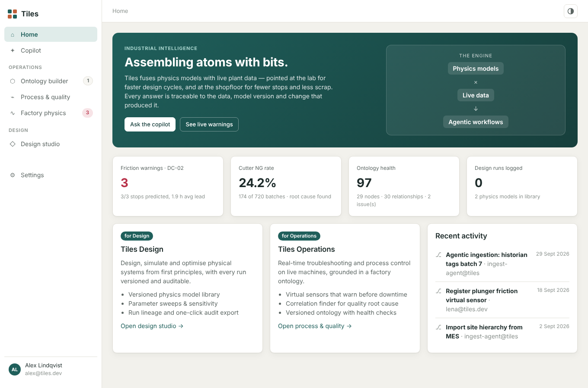
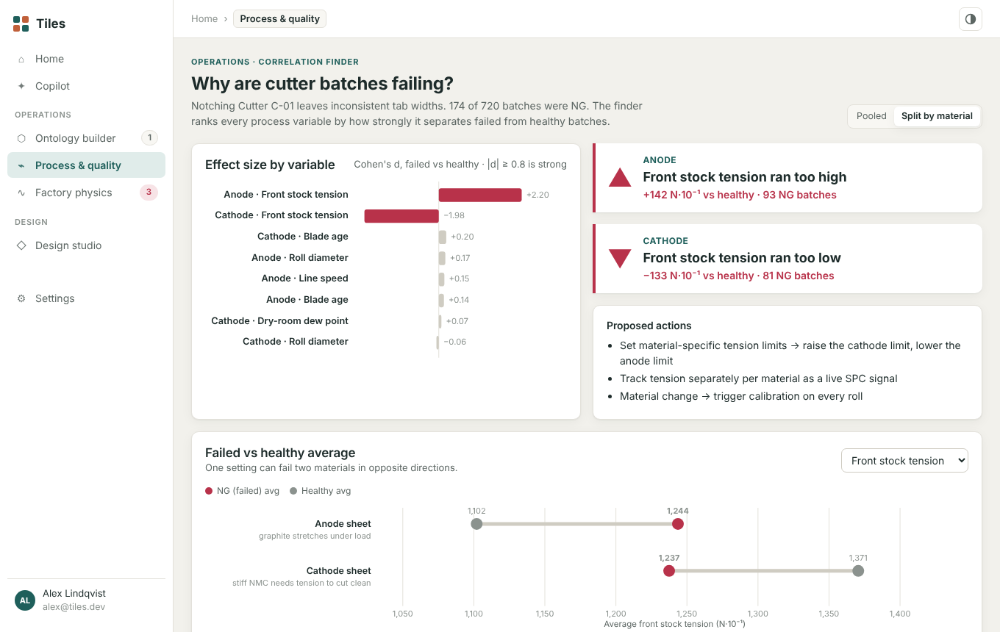
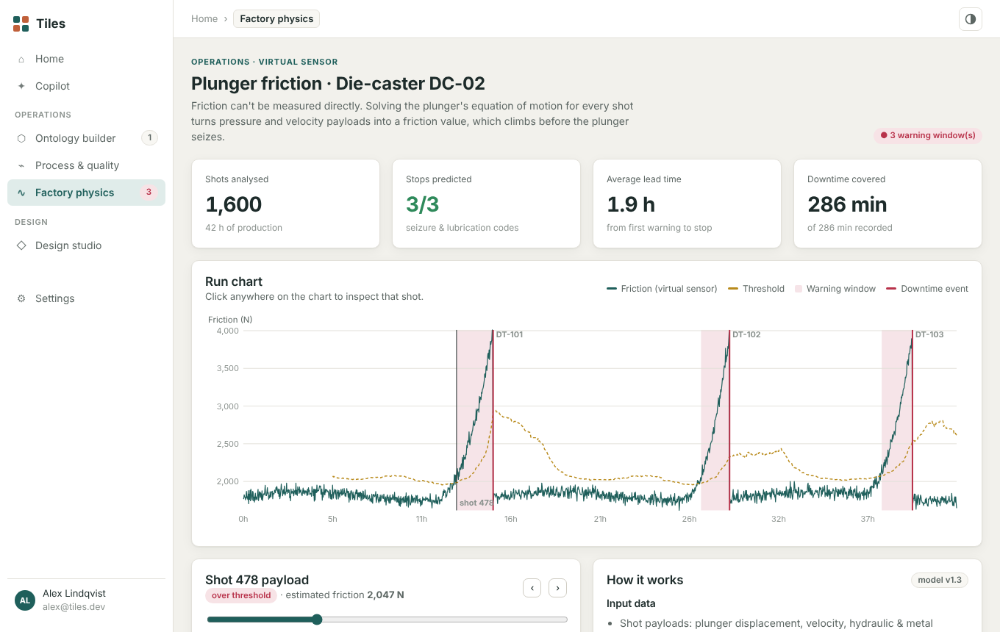

# Tiles

**A workspace for industrial R&D and shopfloor teams: factory model, virtual sensors, root-cause analysis and design studies.**

Tiles is a zero-dependency web app that pairs first-principles physics with plant data. It has two halves:

| | Tiles Design (R&D) | Tiles Operations (shopfloor) |
|---|---|---|
| Who | R&D, simulation and process engineers | Production, quality and maintenance teams |
| What | Versioned physics models, parameter sweeps, sensitivity, run lineage, audit export | Factory ontology, virtual sensors, correlation finder, predictive maintenance, copilot |



## Run it

**Quickest:** open `index.html` in your browser (double-click it). No install needed.

**With a local server:**

```bash
npm start        # node server.js → http://localhost:5173
npm test         # checks the bundle is current, then runs the unit tests
```

Requires Node 22.12+ for the server and tests. See [CONTRIBUTING.md](CONTRIBUTING.md) for linting, formatting and the browser tests.

The source lives in `js/`, in strict TypeScript. Browsers block module scripts on pages opened from disk, so the page loads a single generated file, `js/tiles.bundle.js`. After editing anything in `js/`, run `npm run build` to regenerate it; `npm test` fails if you forget.

## What's inside

- **Copilot.** Ask a question in plain language. The copilot picks a skill (graph query, correlation analysis, virtual sensor, change detection or health check), runs it on the plant data, and shows each step it took. It runs fully offline.
- **Ontology builder.** A typed factory graph (Site → Workcenter → Line → Machine, plus processes, materials, PLCs, signals, documents and models). Edits are staged and then committed with a message and author, Git style. Any commit can be reverted. The health check flags orphan nodes, dangling or duplicate relationships, and missing required properties, and offers a one-click fix.
- **Process & quality.**
  - *Correlation finder:* ranks process variables by effect size (Cohen's d) between failed and healthy batches. On pooled data nothing stands out. Split by material, it shows that front stock tension runs too high for anode sheets and too low for cathode sheets.
  - *Predictive maintenance:* welding power as a second tip-wear signal next to the cycle counter.
- **Factory physics.** A plunger-friction virtual sensor for a die-caster. Friction is solved from the equation of motion `m·a = Ph·Ah − Pm·Am − F` for every shot. Warnings fire against a rolling 200-shot robust baseline. Every seizure stop in the demo data is caught about 2 h ahead.
- **Design studio.** Cell swelling-force and humanoid-actuator models, each with several versions. Includes live parameter sliders, cross-version comparison, 2-D sweep heatmaps and sensitivity bars. Saved runs record their parent run, model version and exact parameters. Click a run to restore it, or export a JSON audit record.





## Backend (in progress)

`api/` holds the FastAPI service that the roadmap builds on (Month 1 onwards). So far it serves `/health` with JSON request logs. See [api/README.md](api/README.md):

```bash
cd api && uv sync && uv run tiles-api   # http://localhost:8000/docs
```

## Roadmap

The 6-month plan to take Tiles from demo to a production pilot is in [docs/ROADMAP.md](docs/ROADMAP.md), with the task-by-task breakdown in [docs/TASKS.md](docs/TASKS.md).

## Data

All plant data is synthetic and generated from fixed seeds (`js/lib/data.ts`, `js/lib/physics.ts`), so results are reproducible. Ontology commits, design runs, chat history and profile are saved in the browser's `localStorage`. Use **Settings → Reset workspace** to start over.

## Layout

```
index.html            app shell
css/styles.css        theme tokens (light + dark) and components
js/app.ts             state, router, navigation
js/tiles.bundle.js    generated by Vite (npm run build); what index.html loads
js/lib/               pure, tested logic (strict TypeScript)
  ontology.ts         graph ops, staging/commit/revert, health check, queries
  physics.ts          shot simulation, friction estimation, alerting
  analysis.ts         correlation finder, wear check
  design.ts           physics model library, sweeps, sensitivity, run lineage
  copilot.ts          skill routing and traceable answers
  data.ts             seeded demo plant
  stats.ts, rng.ts    numerics
  svg.ts, dom.ts      charts and helpers
js/views/             one module per page
test/                 Vitest unit suites
e2e/                  Playwright browser smoke tests
docs/adr/             architecture decision records
server.js             zero-dependency static server
api/                  FastAPI backend (Python, uv)
vite.config.js        Vite build (classic bundle) and Vitest config
scripts/              bundle freshness check
```
